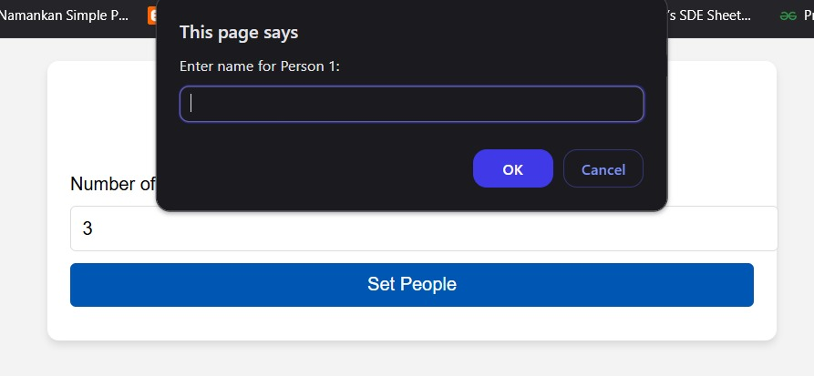
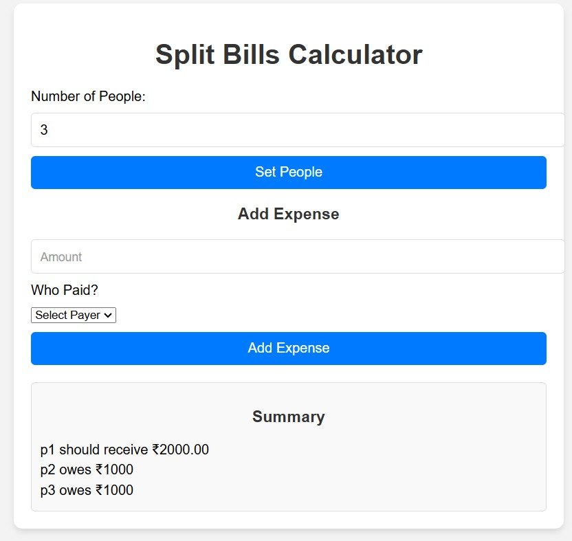

# Split Bills Calculator

An interactive **web application** designed to simplify splitting bills among multiple people. Built using **HTML**, **CSS**, and **JavaScript**, this tool allows users to manage shared expenses effortlessly, ensuring fairness and transparency.

---

## Features

- **Add People:** Dynamically add participants and track individual balances.
- **Add Expenses:** Record expenses and assign them to a payer.
- **Automatic Split:** Calculate and adjust balances for each person based on contributions and shares.
- **Expense Summary:** View a clear breakdown of who owes or should receive money.

---

## Technologies Used

- **HTML**: Provides the structure of the application.
- **CSS**: Enhances the visual design with a clean and modern interface.
- **JavaScript**: Handles the logic for splitting bills, managing data, and updating the UI dynamically.

---

## How to Run

1. Clone or download this repository.
2. Navigate to the project folder.
3. Open the `index.html` file in your preferred browser.
4. Start splitting bills with an easy-to-use interface!

---

## Demo

### Interface Overview  
  

### Expense Summary Example  
  

---

## Future Enhancements

- Add a feature to **export summaries** as PDFs or spreadsheets.
- Include support for **currency conversion** for international groups.
- Enhance the UI with **dark mode** and improved responsiveness.

---

Contributions, forks, and suggestions are always welcome! Feel free to enhance this project and share your ideas.
